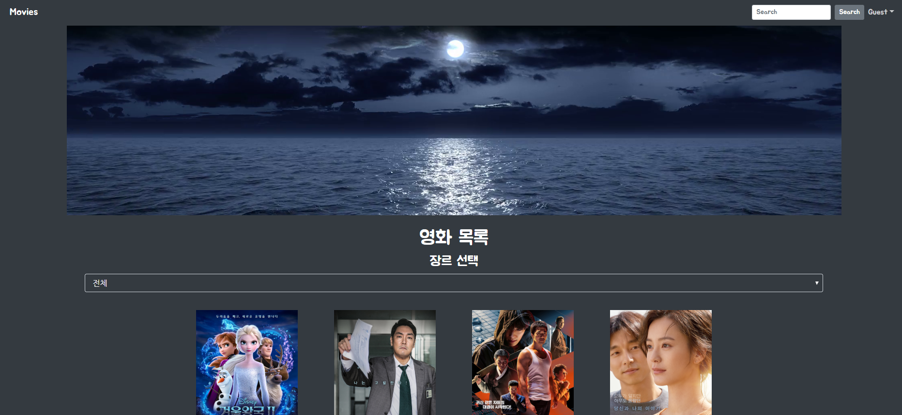

# MJHH Movies


### 1. 프로젝트 정보

| 팀원   | 업무 내용                                                    |
| ------ | ------------------------------------------------------------ |
| 김현화 | Django 모델 구성, Vue 컴포넌트 관리 및 Vue Axios(로그인, front-back 연결) |
| 백민주 | Django 모델 구성, 데이터 수집 및 관리(API이용), CSS 및 부트스트랩 |

날짜 2019.11.22 ~ 2019.11.29 


## FRONTEND - VUE.JS

- 최종 화면




### NavBar

search기능 구현 - 제목, 배우, 감독, 내용을 기반으로 검색을 할 수 있다. 

```

```

장르별로 영화들을 필터링 할 수 있다. (영화 장르 20개)

디테일 페이지 만들기


like, comment 기능 구현(detail에)

nav bar만들기

검색기능 만들기

## 11.28

디테일 페이지에 코멘트 구현하기

로그인 후 마이페이지 들어가게

추천 알고리즘 적용하기

admin은 회원정보 수정 삭제 가능


## BACKEND - DJANGO


### 1. 초기 파일 셋팅

front와 back파일을 만들어 front는 vue로, back은 django로 만들기로 했다.

python -m venv venv로 가상환경을 만들고 가상환경을 잡았다.

finalpjt라는 프로젝트와 movies라는 앱을 만들었다.

back 내 settings.py를 설정했다. (시간대, 언어 설정, 만든 앱 프로젝트에 등록하기)


### 2. 데이터베이스 모델링(ERD)

draw.io 추가예정


### 3.  URL 만들기

```python
from django.urls import path, include
from . import views
urlpatterns = [
    path('movielist/', views.movielist),
    path('update/', views.update),
    path('create/', views.create),
    path('moviedetail/<int:movie_pk>/', views.moviedetail),
    path('genrelist/', views.genrelist),
    path('genredetail/<int:genre_pk>/', views.genredetail),
    path('commentcreate/<int:movie_pk>/', views.commentcreate),
    path('comment_update_and_delete/<int:comment_pk>/', views.comment_update_and_delete),
    path('userlist/', views.userlist),
    path('userdetail/<int:user_pk>/', views.userdetail),
]
```


### 4.  시리얼라이저와 모델 만들기

- 시리얼라이저

영화정보를 저장하고 이에 따라 추천하는 사이트이므로 크게 movie, comment, genre, user serializer을 만들었다. 각 시리얼라이저에 담길 내용을 필드로 설정했다.

시리얼라이저에 따라 장고 모델을 만들었다.

- 모델

1. movie 하나는 여러개의 liked users을 가지고 각각의 user도 여러개의 movie를 좋아요 할 수 있으므로 many to may field로 설정해주었다. (movie와 user의 m:n관계 형성)

class User(AbstractUser):

​    liked_genres = models.ManyToManyField(settings.AUTH_USER_MODEL, related_name='liked_users')

2. 영화 하나에 여러 코멘트가 달릴 수 있으므로 movie:comment를 1:n 관계로 설정해주었다.

movie = models.ForeignKey(Movie, related_name="comments", on_delete=models.CASCADE)

```
python manage.py makemigrations
python manage.py migrate
```

### 5. Views.py

영화진흥위원회 API와 네이버 영화 API를 통해 필요한 정보를 다 받아서 저장하는 views.py의 함수를 정의했다. 진짜 길다.

현재로부터 52주간 주말 데이터를 불러왔다. 영진위에서 movieCd(영화코드)를 받아오고 이를 네이버에서 제공하는 영화코드와 비교했다. 네이버 코드를 통해 이미지가 있는 네이버 링크와  description을 불러오고 다른 모든 정보를 받아왔다.  

movies = {}라는 딕셔너리를 만들어 그곳에 모든 정보를 넣고 맨 아래코드로 각 정보를 매칭했다.

```python
def update(request):
    # 영진위 코드
    baseurl = 'http://www.kobis.or.kr/kobisopenapi/webservice/rest/boxoffice/searchWeeklyBoxOfficeList.json'
    movies = {}
    NAVER_URL = 'https://openapi.naver.com/v1/search/movie.json'
    CLIENT_ID = config('CLIENT_ID')
    CLIENT_SECRET = config('CLIENT_SECRET')
    HEADERS = {
        "X-Naver-Client-Id": CLIENT_ID,
        "X-Naver-Client-Secret": CLIENT_SECRET,
        }
    all_movies = Movie.objects.all()
    for da in range(52): 
        targetDt = datetime(2019, 11, 23) - timedelta(weeks=da)
        targetDt = targetDt.strftime('%Y%m%d')
        key = config('API_KEY')                 
        api_url = f'{baseurl}?key={key}&targetDt={targetDt}&weekGb=1'
        response = requests.get(api_url).json()
        for value in response.get('boxOfficeResult').get('weeklyBoxOfficeList'):
            flag = 0
            if movies.get(value['movieCd']) == None:
                for i in range(len(all_movies)):
                    if str(all_movies[i]) == value['movieNm']:
                        flag = 1
                        break
                if flag == 0:
                    movies[value['movieCd']] = [value['movieNm'], value['audiAcc'], value['openDt']]
    # naver
    for moviecode in movies.keys():
        try:
            query = movies[moviecode][0]
            API_URL = f'{NAVER_URL}?query={query}'
            time.sleep(0.05)
            response_naver = requests.get(API_URL,headers=HEADERS).json()
            datas = response_naver['items'][0]

            # image
            naver_code = datas['link']
            naver_code = naver_code.split('=')[1]
            image_url = f'https://movie.naver.com/movie/bi/mi/photoViewPopup.nhn?movieCode={naver_code}'
            response = requests.get(image_url)
            new = response.text
            soup = BeautifulSoup(new, 'html.parser')
            img = str(soup.select('img')[0])
            final = img.split('src=')
            final_url = final[-1]
            final_url = final_url[1:-3]

            # description
            des = datas['link']
            html = urlopen(des)
            source = html.read()
            html.close()
            soup = BeautifulSoup(source, 'html.parser')
            description = soup.find('p', class_='con_tx')
            step = soup.find('dl', 'info_spec')
            genre = step.find('a').text
            genre_name = {'드라마':1, '판타지':2, '서부':3, '공포':4, '로맨스':5, '모험':6, '스릴러':7, '느와르':8, '컬트':9, '다큐멘터리':10, '코미디':11, '가족':12, '미스터리':13, '전쟁':14, '애니메이션':15, '범죄':16, '뮤지컬':17, 'SF':18, '액션':19, '무협':20, '에로': 21, '서스펜스':22, '서사':23, '블랙코미디':24, '실험':25, '영화카툰':26, '영화음악':27, '영화패러디포스터':28, '멜로/로맨스':29}
            grade = step.find_all('dd')[3].find('a').text
            running = int(step.find('dd').find_all('span')[2].text[:-2])
            movies[moviecode].extend([datas['director'], datas['actor'], datas['userRating'], final_url, description.get_text(), genre_name.get(genre), grade, running])
            movie = Movie()
            movie.title = movies[moviecode][0]
            movie.audience = movies[moviecode][1]
            movie.open_date = movies[moviecode][2]
            movie.director = movies[moviecode][3]
            movie.actor = movies[moviecode][4]
            movie.naver_score = movies[moviecode][5]
            movie.poster_url = movies[moviecode][6]
            movie.description = movies[moviecode][7]
            movie.genre = get_object_or_404(Genre, pk=movies[moviecode][8])
            movie.grade = movies[moviecode][9]
            movie.running_time = movies[moviecode][10]
            movie.save()
        except:
            print('error')
```


### 6. Settings.py

settings.py설정, 엄청난 installed apps

```python
INSTALLED_APPS = [
    'movies',
    
    'rest_framework',
    'corsheaders',
    'rest_auth',
    'rest_auth.registration',
    'allauth',
    'allauth.account',
    'django.contrib.sites',
    'django.contrib.admin',
    'django.contrib.auth',
    'django.contrib.contenttypes',
    'django.contrib.sessions',
    'django.contrib.messages',
    'django.contrib.staticfiles',
]
```

## 

### 7. Back 마무리

부트스트랩 적용하기


